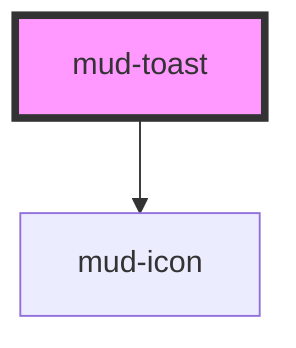

# mud-toast

<!-- Auto Generated Below -->

## Overview

Toast — semantic toast message (350px filled surface, 8px radius).

Matches the Figma `toast` component (page "Messaging (Notification)"):
a leading icon, an optional bold heading, the message body (default slot),
an optional inline link/action group (`actions` slot) and a trailing close
button (shown by default — `closable` defaults to `true`).

Placement, vertical stacking and auto-dismiss are the consumer's
responsibility — this atom is just the surface. Its entrance animation
(slide-down + fade-in) plays once on mount.

Pattern B (atom-display + interactive close): the close affordance lives
inside shadow DOM so it participates in tab order with a real
`button` role. The body itself is not interactive.

`variant` selects the semantic color family — `info`, `warning`, `success`,
or `error` — each a filled toast surface with its own leading icon.

Live-region routing:
- `info` / `success` → `role="status"` + `aria-live="polite"`
- `warning` / `error` → `role="alert"` + `aria-live="assertive"`

## Properties

| Property     | Attribute     | Description                                                                                                                                                                                                                                                                                                     | Type                                          | Default     |
| ------------ | ------------- | --------------------------------------------------------------------------------------------------------------------------------------------------------------------------------------------------------------------------------------------------------------------------------------------------------------- | --------------------------------------------- | ----------- |
| `ariaLabel`  | `aria-label`  | Forwarded to the host as `aria-label`. Use this to give the entire toast an explicit accessible name when the body content alone is not descriptive enough.                                                                                                                                                     | `string \| undefined`                         | `undefined` |
| `closable`   | `closable`    | Renders a trailing close button. Activating it emits `mudClose`; the consumer is responsible for removing the toast from the DOM. Defaults to `true` per the Figma `toast` component (`Close = true`); set `closable="false"` for a toast the user cannot dismiss manually (e.g. one that only auto-dismisses). | `boolean`                                     | `true`      |
| `closeLabel` | `close-label` | Close-button accessible label. Defaults to the Romanian "Închide". Provide an alternative for non-Romanian locales.                                                                                                                                                                                             | `string`                                      | `'Închide'` |
| `iconName`   | `icon-name`   | Override the default `mud-icon` name for the variant (e.g. swap `circle-info-filled` for a custom glyph). When the `icon-start` slot is populated, this prop is ignored.                                                                                                                                        | `string \| undefined`                         | `undefined` |
| `titleText`  | `title-text`  | Optional bold title rendered above the body.                                                                                                                                                                                                                                                                    | `string \| undefined`                         | `undefined` |
| `variant`    | `variant`     | Semantic color family.                                                                                                                                                                                                                                                                                          | `"error" \| "info" \| "success" \| "warning"` | `'info'`    |

## Events

| Event      | Description                                                                                                                              | Type                |
| ---------- | ---------------------------------------------------------------------------------------------------------------------------------------- | ------------------- |
| `mudClose` | Fires when the user activates the close button. Payload is `void` — the consumer is responsible for the dismiss animation / DOM removal. | `CustomEvent<void>` |

## Slots

| Slot           | Description                                                                                                                                                 |
| -------------- | ----------------------------------------------------------------------------------------------------------------------------------------------------------- |
|                | (default) The message body. Plain text or rich inline content.                                                                                              |
| `"actions"`    | Optional inline action group (typically `mud-button` or           `mud-link`). Aligned to the trailing edge before the close           button when present. |
| `"icon-start"` | Optional override for the leading icon. When supplied,              suppresses both the `iconName` prop and the per-variant              default icon.      |

## Dependencies

### Depends on

- [mud-icon](../mud-icon)

### Graph

----------------------------------------------

*Built with [StencilJS](https://stenciljs.com/)*
