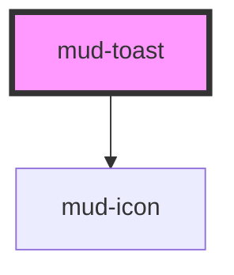

# mud-toast

<!-- Auto Generated Below -->

## Overview

Toast — semantic toast message (350px filled surface, 8px radius).

Matches the Figma `toast` component (page "Messaging (Notification)"):
a leading icon, an optional bold heading, the message body (default slot),
an optional inline link/action group (`actions` slot) and a trailing close
button (shown by default — `closable` defaults to `true`).

Placement, vertical stacking and auto-dismiss are the consumer's
responsibility — this atom is just the surface. Its entrance animation
(slide-down + fade-in) plays once on mount; closing it fades it out in
place before `mudClose` fires (Figma Behavior › dismissal).

Pattern B (atom-display + interactive close): the close affordance lives
inside shadow DOM so it participates in tab order with a real
`button` role. The body itself is not interactive.

`variant` selects the semantic color family — `info`, `warning`, `success`,
or `error` — each a filled toast surface with its own leading icon.

Live-region routing:
- `info` / `success` → `role="status"` + `aria-live="polite"`
- `warning` / `error` → `role="alert"` + `aria-live="assertive"`

Set the native `aria-label` attribute on the host for an explicit accessible
name when the body content alone is not descriptive enough.

## Properties

| Property     | Attribute     | Description                                                                                                                                                                                                                                                                                                     | Type                                                                                                                                                                                                                                                                                                                                                                                                                                                                                                                                                                                                                                                                                                                                                                                                                                                                                                                                                                                                                                                                                                                                                                                                                                                                                                                                                                                                                                                                                                                                                                                                                                                                                                                                                                                                                                                                                                                                                                                                                                                                                                                                                                                                                                                                                                                                                                                                                                                                                                                                                                                                                                                                                                                  | Default     |
| ------------ | ------------- | --------------------------------------------------------------------------------------------------------------------------------------------------------------------------------------------------------------------------------------------------------------------------------------------------------------- | --------------------------------------------------------------------------------------------------------------------------------------------------------------------------------------------------------------------------------------------------------------------------------------------------------------------------------------------------------------------------------------------------------------------------------------------------------------------------------------------------------------------------------------------------------------------------------------------------------------------------------------------------------------------------------------------------------------------------------------------------------------------------------------------------------------------------------------------------------------------------------------------------------------------------------------------------------------------------------------------------------------------------------------------------------------------------------------------------------------------------------------------------------------------------------------------------------------------------------------------------------------------------------------------------------------------------------------------------------------------------------------------------------------------------------------------------------------------------------------------------------------------------------------------------------------------------------------------------------------------------------------------------------------------------------------------------------------------------------------------------------------------------------------------------------------------------------------------------------------------------------------------------------------------------------------------------------------------------------------------------------------------------------------------------------------------------------------------------------------------------------------------------------------------------------------------------------------------------------------------------------------------------------------------------------------------------------------------------------------------------------------------------------------------------------------------------------------------------------------------------------------------------------------------------------------------------------------------------------------------------------------------------------------------------------------------------------------------- | ----------- |
| `closable`   | `closable`    | Renders a trailing close button. Activating it emits `mudClose`; the consumer is responsible for removing the toast from the DOM. Defaults to `true` per the Figma `toast` component (`Close = true`); set `closable="false"` for a toast the user cannot dismiss manually (e.g. one that only auto-dismisses). | `boolean`                                                                                                                                                                                                                                                                                                                                                                                                                                                                                                                                                                                                                                                                                                                                                                                                                                                                                                                                                                                                                                                                                                                                                                                                                                                                                                                                                                                                                                                                                                                                                                                                                                                                                                                                                                                                                                                                                                                                                                                                                                                                                                                                                                                                                                                                                                                                                                                                                                                                                                                                                                                                                                                                                                             | `true`      |
| `closeLabel` | `close-label` | Close-button accessible label. Defaults to the Romanian "Închide". Provide an alternative for non-Romanian locales.                                                                                                                                                                                             | `string`                                                                                                                                                                                                                                                                                                                                                                                                                                                                                                                                                                                                                                                                                                                                                                                                                                                                                                                                                                                                                                                                                                                                                                                                                                                                                                                                                                                                                                                                                                                                                                                                                                                                                                                                                                                                                                                                                                                                                                                                                                                                                                                                                                                                                                                                                                                                                                                                                                                                                                                                                                                                                                                                                                              | `'Închide'` |
| `iconName`   | `icon-name`   | Override the default `mud-icon` name for the variant (e.g. swap `circle-info` for a custom glyph). When the `icon-start` slot is populated, this prop is ignored.                                                                                                                                               | `"add-cart" \| "alarm" \| "arrow-down" \| "arrow-left" \| "arrow-right" \| "arrow-up" \| "arrow-up-right" \| "asterisk" \| "attachment" \| "award" \| "backspace" \| "barcode" \| "barrier" \| "book" \| "bookmark" \| "bubble-alert" \| "bubble-heart" \| "bubble-question" \| "building" \| "bullet-list" \| "business" \| "calculator" \| "calendar" \| "calendar-add" \| "calendar-edit" \| "calendar-remove" \| "car" \| "card-link" \| "carousel" \| "cart" \| "chart" \| "check-all" \| "checklist" \| "checkmark-large" \| "checkmark-small" \| "chevron-bottom" \| "chevron-bottom-medium" \| "chevron-bottom-small" \| "chevron-grabber" \| "chevron-left" \| "chevron-left-small" \| "chevron-right" \| "chevron-right-small" \| "chevron-top" \| "chevron-top-small" \| "child" \| "circle-checkmark" \| "circle-download" \| "circle-error" \| "circle-info" \| "clock" \| "cloud-upload" \| "coins" \| "contacts" \| "copy" \| "credit-card" \| "cross-large" \| "cross-small" \| "data-access" \| "delete" \| "direction" \| "dislike" \| "document" \| "document-info" \| "dot" \| "dot-grid" \| "download" \| "drag" \| "edit" \| "education" \| "electronic-signature" \| "empty-bin" \| "envelope" \| "exclamation" \| "external-link" \| "eye-open" \| "face-id" \| "facebook" \| "faq" \| "feedback" \| "file-download" \| "filter" \| "flag" \| "flash" \| "flash-off" \| "globe" \| "group" \| "hashtag" \| "health" \| "help" \| "history" \| "home-line" \| "home-round-door" \| "house" \| "id-card" \| "identity" \| "image" \| "instagram" \| "judge-gavel" \| "light-bulb" \| "like" \| "linkedin" \| "lock" \| "logout" \| "map-pin" \| "mark-all" \| "menu" \| "minus-small" \| "mobile-phone" \| "moon" \| "more-horizontal" \| "more-vertical" \| "notification" \| "old-man" \| "organisation" \| "page-add" \| "page-child" \| "page-download" \| "page-house" \| "page-text" \| "page-text-lock" \| "page-upload" \| "passport" \| "pdf-file" \| "people" \| "people-like" \| "permission" \| "person" \| "phone" \| "pin" \| "plus-large" \| "plus-small" \| "qr-code" \| "receipt-bill" \| "receipt-check" \| "reorder" \| "reschedule" \| "resize" \| "rotate-arrow" \| "scan" \| "search" \| "services" \| "settings" \| "share-android" \| "share-ios" \| "shield" \| "shield-keyhole" \| "shield-user" \| "sidebar" \| "signal" \| "signature" \| "sort" \| "sparkles" \| "stamp" \| "store" \| "suitcase" \| "suitcase-2" \| "sun" \| "support" \| "templates" \| "tiktok" \| "time" \| "tree" \| "umbrella" \| "unlocked" \| "upload" \| "user-account" \| "vacation" \| "visiting-card" \| "voucher" \| "wallet" \| "warning" \| "wheelchair" \| "youtube" \| undefined` | `undefined` |
| `titleText`  | `title-text`  | Optional bold title rendered above the body.                                                                                                                                                                                                                                                                    | `string \| undefined`                                                                                                                                                                                                                                                                                                                                                                                                                                                                                                                                                                                                                                                                                                                                                                                                                                                                                                                                                                                                                                                                                                                                                                                                                                                                                                                                                                                                                                                                                                                                                                                                                                                                                                                                                                                                                                                                                                                                                                                                                                                                                                                                                                                                                                                                                                                                                                                                                                                                                                                                                                                                                                                                                                 | `undefined` |
| `variant`    | `variant`     | Semantic color family.                                                                                                                                                                                                                                                                                          | `"error" \| "info" \| "success" \| "warning"`                                                                                                                                                                                                                                                                                                                                                                                                                                                                                                                                                                                                                                                                                                                                                                                                                                                                                                                                                                                                                                                                                                                                                                                                                                                                                                                                                                                                                                                                                                                                                                                                                                                                                                                                                                                                                                                                                                                                                                                                                                                                                                                                                                                                                                                                                                                                                                                                                                                                                                                                                                                                                                                                         | `'info'`    |

## Events

| Event      | Description                                                                                                                                           | Type                |
| ---------- | ----------------------------------------------------------------------------------------------------------------------------------------------------- | ------------------- |
| `mudClose` | Fires once the close fade-out has finished (at once under `prefers-reduced-motion`). Payload is `void` — the consumer removes the toast from the DOM. | `CustomEvent<void>` |

## Slots

| Slot           | Description                                                                                                                                                                               |
| -------------- | ----------------------------------------------------------------------------------------------------------------------------------------------------------------------------------------- |
|                | (default) The message body. Plain text or rich inline content.                                                                                                                            |
| `"actions"`    | Optional inline action group (typically `mud-button` or           `mud-link`). Renders as its own line below the heading/body           stack (Figma `toast` `w/ heading: link` variant). |
| `"icon-start"` | Optional override for the leading icon. When supplied,              suppresses both the `iconName` prop and the per-variant              default icon.                                    |

## Dependencies

### Depends on

- [mud-icon](../mud-icon)

### Graph

----------------------------------------------

*Built with [StencilJS](https://stenciljs.com/)*
